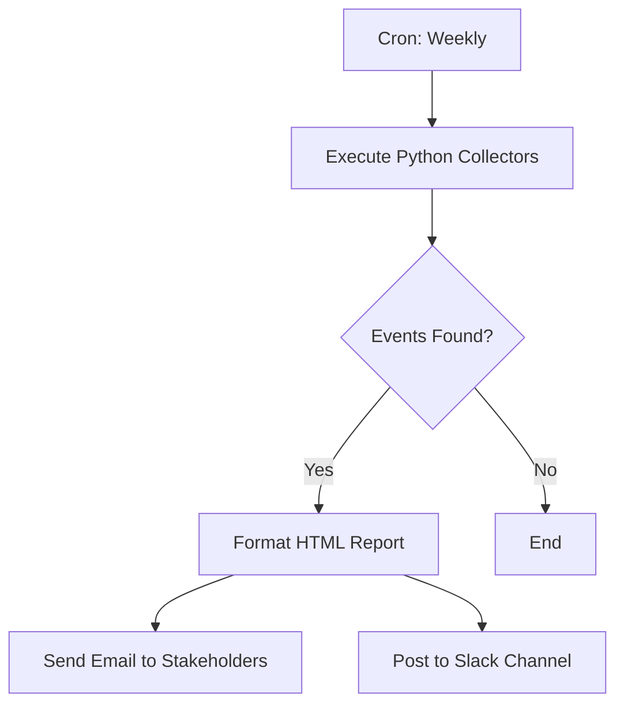

# Implementation Plan: Phase 2 - Automation & Reporting

## Goal
Automate the weekly collection and reporting of events from NYRR, Prospect Park, and NWS Weather to provide stakeholders with actionable intelligence.

---

## Option 1: Full Google/Python Integration

### Architecture
- **Infrastructure**: Google Cloud Functions (or a persistent VM).
- **Trigger**: Google Cloud Scheduler (Cron job set to `0 8 * * 1` - Mondays at 8:00 AM).
- **Process**:
    1.  Scheduler triggers the Cloud Function.
    2.  Function executes the Python collectors for NYRR, Prospect Park, and Weather.
    3.  Data is aggregated and formatted into a professional HTML email template.
    4.  Email is dispatched via SMTP (SendGrid or Gmail API).

### Deployment Steps
1.  **Code Packaging**: Bundle `src/` directory into a Google Cloud Function.
2.  **Environment Variables**: Securely store API keys (if any) and Email Credentials in Secret Manager.
3.  **Authentication**: Use an App Password if using Gmail, or an API Key for SendGrid.
4.  **Monitoring**: Use Cloud Logging to track successful runs and error alerts.

---

## Option 2: Hybrid n8n Workflow (Recommended for Flexibility)

### Architecture
- **Infrastructure**: n8n (hosted or local).
- **Trigger**: n8n "Cron" node.
- **Process**:
    1.  **Schedule**: Monday mornings.
    2.  **Execution Item**: n8n calls a "Python Script" node or an "Execute Command" node running the ingestion logic.
    3.  **Data Processing**: n8n receives the `extracted_events.csv` or JSON output.
    4.  **Notification**: n8n formats the data and sends it via its built-in Email, Slack, or Telegram nodes.

### Workflow Visualization (n8n)

### Benefits
- **Visual Control**: Stakeholders can see the status of the "pipeline" in the n8n UI.
- **Easy Scaling**: Adding a "Slack" notification takes 10 seconds in n8n.
- **No Hosting Management**: If using n8n Cloud, zero server maintenance.

---

## Next Steps
1.  **Select Option**: Await user confirmation on which automation path to prioritize.
2.  **Report Generator**: Develop `src/reporting/report_generator.py` to create the HTML/Text summaries.
3.  **Prototyping**: Build the `n8n_workflow.json` for testing.
